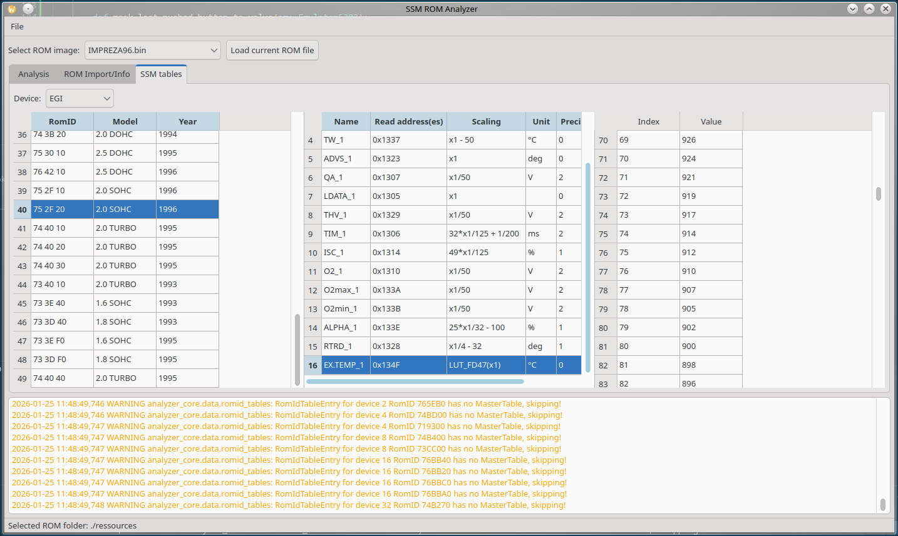

# SSM ROM Analyzer

Analysis and emulation tool for HD6303 based SSM1 cassettes. Including disassembly with function pattern scanning, emulation and parsing.
Based on Python 3.12.




## Installation of requirements
Install the necessary packages with pip:

```
pip install -r requirements.txt
```

## Running analysis
Place ROM files to analyse into the subfolder `./ressources`. They should be ending on `.rom`.

The analyzer can be started with the file `./ssm_gui/app.py`. As it's a tool on running development, it's meant to be run be a debugger (e.g. VSCode).

The ROM cassettes get detected for known functions by patterns. In order to support more patterns for more cassettes, `./ressources/rom_patterns.json` needs to be extended. The decompilation of the tool always runs as far as patterns can be detected, to that it's possible to analyse possible function patterns in the disassembled code.

## Implementation status
- [x] RomID collection for `7xx` based RomIDs
- [x] SSM connection commands
- [x] SSM read RomID commands
- [x] Single address measurement scalings
- [x] Single address switches
- [ ] Implement pre 96 RomIDs without mapped ROM areas
- [ ] Implement `Axx`RomIDs
- [ ] Multi address measurements
- [ ] Multi address switches
- [ ] DTC detection
- [ ] Adjustments and programming functions
- [ ] XML export


## Supported cassettes


|Cassette | part number | status|
|-|-|-|
IMPREZA '96 | 498345800 | supported as above
SVX '96 | |
SVX '97 | |


## Known issues

- SVX '96 and SVX '97 use year label `199*` for some RomIDs, this currently gets resoluted to `1990`, which is wrong
- The methods to calculate a measurement value to a unit heavily change with each cassette and control unit, so that there'll be a lot of more parsing cases expected to be included 
- Not all lookup tables get resoluted into a value table
